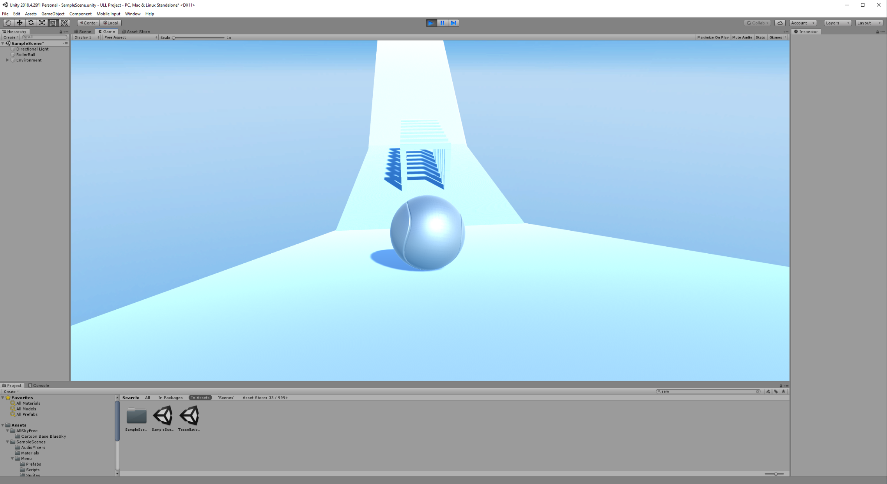
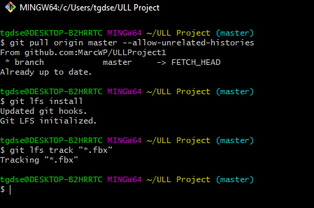

Actividad 1

Foto del proyecto creado en Unity. Bola con controlador de standard assets y rampa creada con formas cúbicas.

Actividad 3

En la primera práctica ya se procedió a crear el repositorio requerido. Tras instalar el asset de Github para unity, lo único que era necesario hacer para finalizar era instalar lfs, configurarlo y hacer un push. Para esta actividad, se han decidido señalar a los ficheros fbx para el seguimiento de lfs.

