Actividad 1

Foto del proyecto creado en Unity. Bola con controlador de standard assets y rampa creada con formas cúbicas.

Actividad 3

En la primera actividad ya se procedió a crear el repositorio requerido. Tras instalar el asset de Github para unity, lo único que era necesario hacer para finalizar era instalar lfs, configurarlo y hacer un push. Para esta actividad, se han decidido señalar a los ficheros fbx para el seguimiento de lfs.

Instalamos lfs y marcamos los ficheros fbx:

Hacemos cambios y commit:

Hacemos push:

Como se puede observar, tras el proceso, los ficheros en formato .fbx han sido almacenados con lfs.

Actividad 4

En esta actividad se procederá a configurar Unity collab. Al carecer de grupo, el único miembro del collab deberé ser yo mismo. 
Para ello, empezaremos seleccionando el botón "Collab" en la zona superior derecha del editor, presionando sobre el borron "Start now!".

Seleccionamos un Unity ID. Si no tenemos uno creado, seleccionamos nuestro nombre de usuario y seleccionamos en "Create".

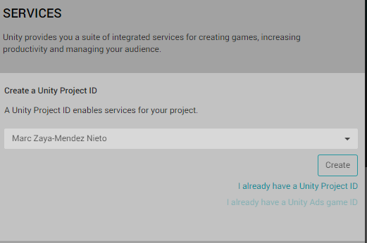

Una vez creado el Unity ID, volvemos al botón "Collab" en la zona superior derecha del editor. Si apretamos en "Start now!", Unity comenzará a preparar unestro proyecto para ser utilizado en Unity Collaboration.

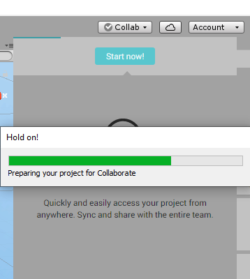

Una vez finalizado el proceso, podremos empezar a utilizar Unity collab. Como ejemplo, creamos un cubo, guardamos la escena y publicamos los cambios a través de Collab.

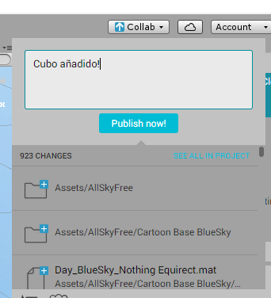

El proceso tardará en completarse, un función del número de cambios realizados.

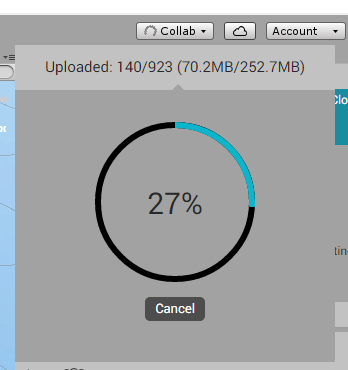

Al finalizar, los otros miembros deberían recibir un aviso acerca de los nuevos cambios. Si queremos agregar a nuevos participantes, nos basta con seleccionar el icono de grupos en la pestaña de Collab.

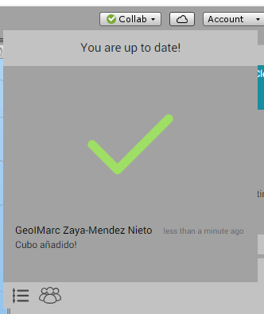

En la nueva ventana, podremos gestionar los miembros del Collab. Presionamos Manage Seats para invitar a nuevos usuarios.

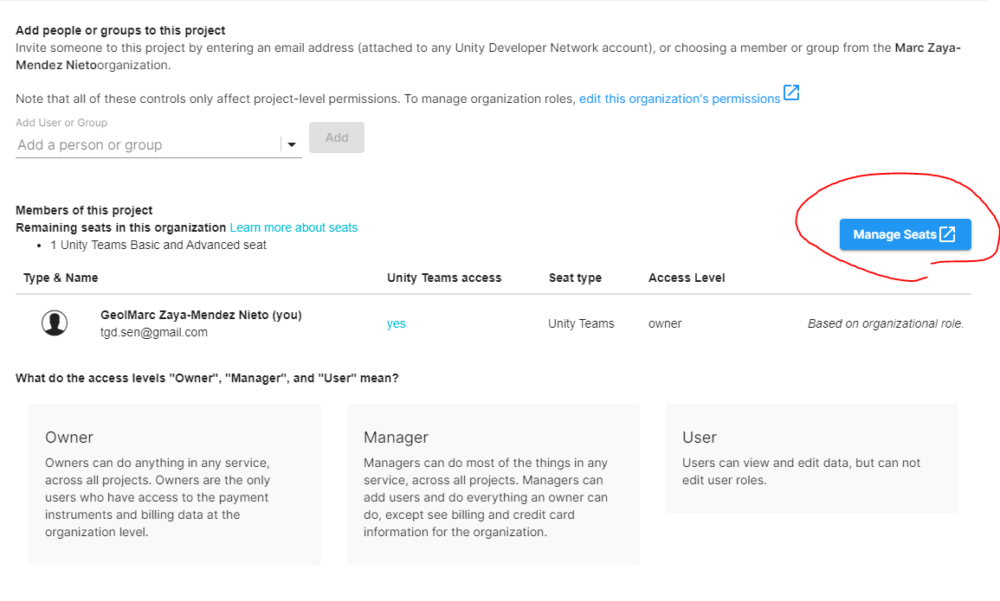

En la zona izquierda, seleccionaremos "Members & Groups".

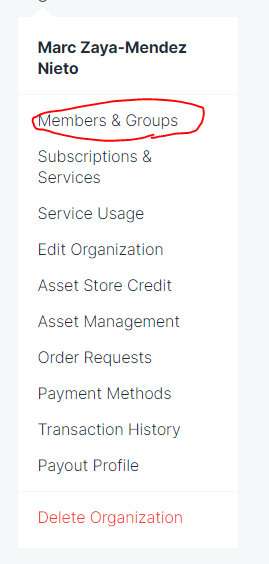

Presionamos en "Add Members"

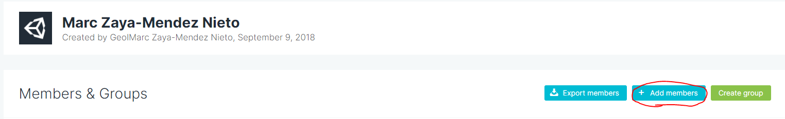

En la nueva ventana introducimos el correo del nuevo participante, seleccionamos su rol y presionamos "Next".

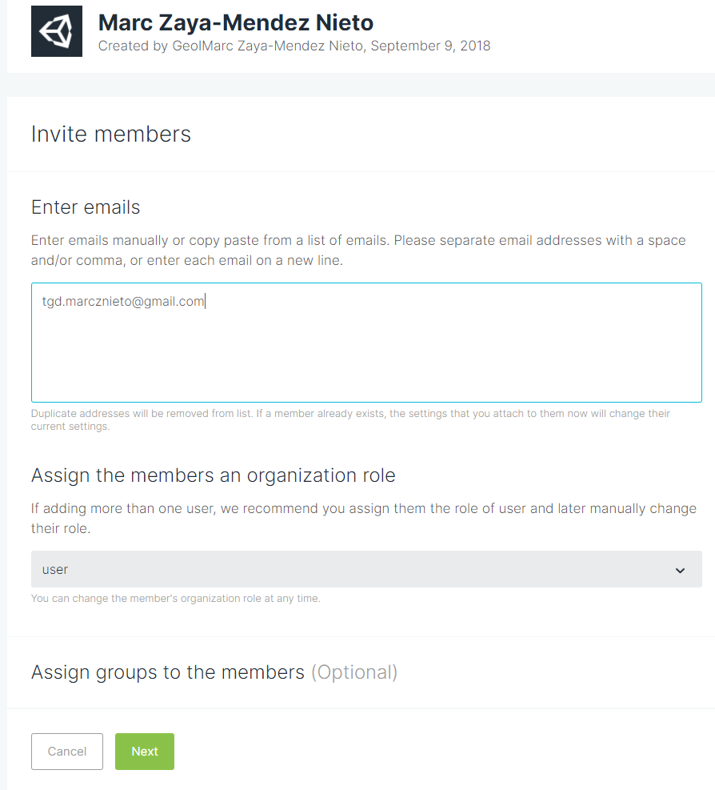

Enviamos una invitación al nuevo colaborador haciendo click en "Invite members".

Tras invitar a los nuevos colaboradores, podremos agregarlos a nuestro proyecto de colaboración desde la ventana de gestión de grupos.

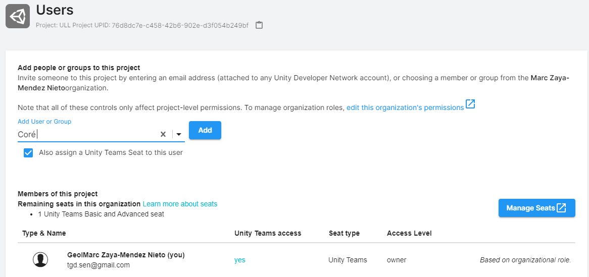

Tras agregar a los nuevos miembros, se les enviará una invitación que deberán aceptar. Una vez aceptada, podrán descargar el proyecto desde la nube. Una vez dentro del proyecto, serán capaces de visualizar, subir y descargar cambios al proyecto desde la pestaña de Collab en el editor de Unity.

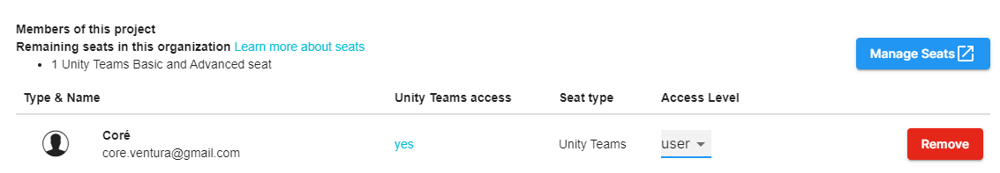

Actividad 5

Para la quinta actividad se procederá a configurar una conexión entre un espacio de trabajo de Perforce y un proyecto de Unity. Para ello:

Descargamos e instalamos el servidor Helix Core.

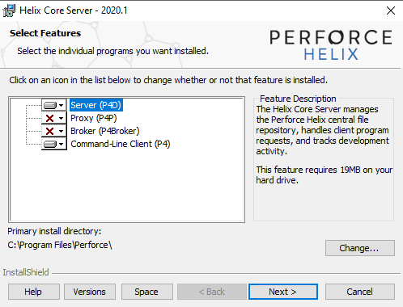

Creamos el espacio de trabajo, especificando la ruta a utilizar.

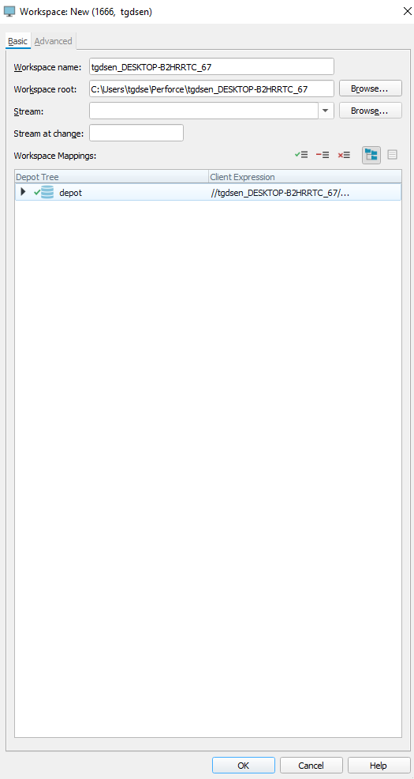

Abrimos la conexión.

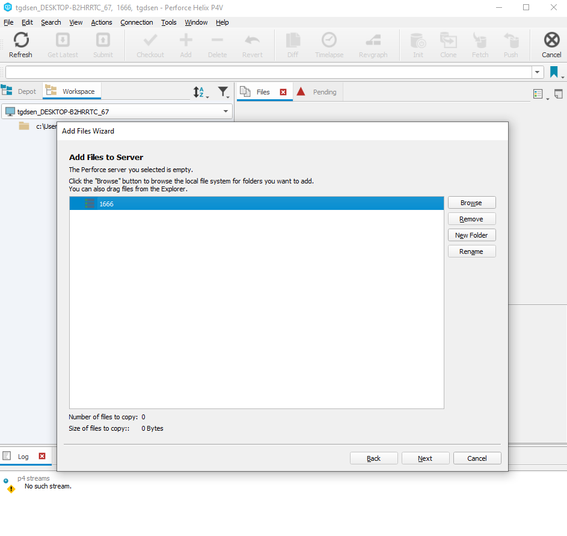

Configuramos la conexión por Perforce a nuestro espacio de trabajo mediante las opciones de nuestro proyecto de Unity.

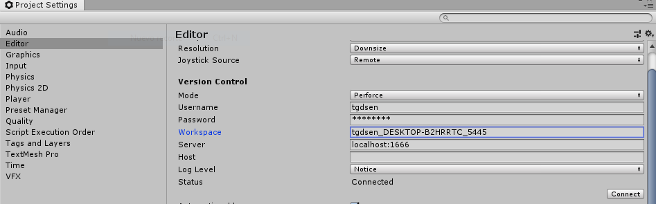

Tras hacer algún cambio en nuestra escena, guardamos y nos dirigimos al panel de Perforce. Bajo la pestaña de cambios pendientes podremos localizar los cambios que hemos realizado a nuestro proyecto.

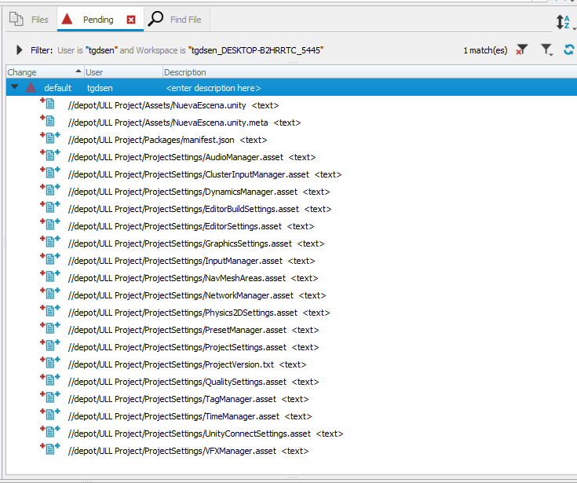

Seleccionamos los cambios pendientes, desplegamos el menú con el click derecho y seleccionamos "enviar". Confirmamos los ficheros a enviar.

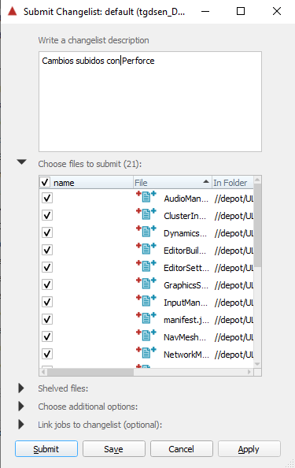

Podremos encontrar los ficheros modificados en nuestro depot del espacio de trabajo.

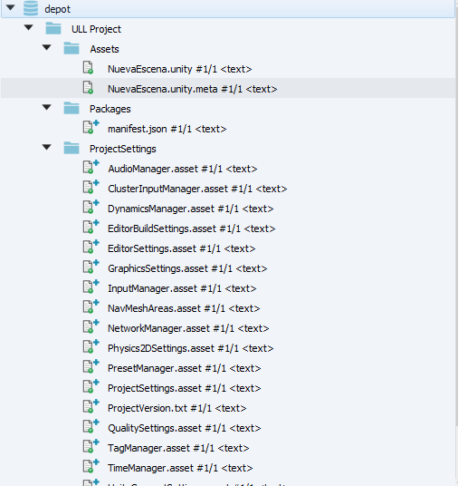

También podremos localizar dichos cambios en nuestra carpeta de servidor de Perforce.

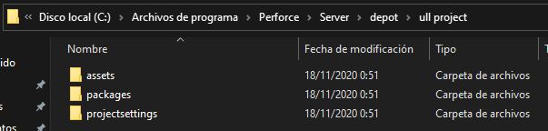